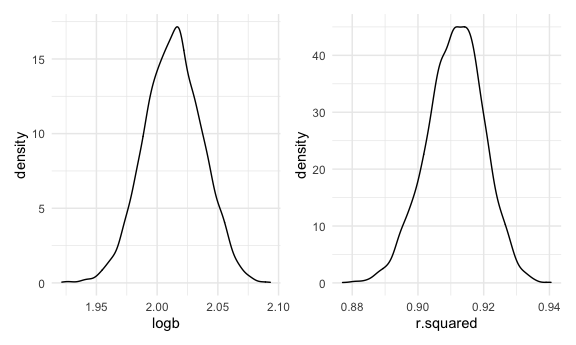

Homework 6
================
Megan Marziali

## Problem 1

Read in the data.

``` r
homicide_df = 
  read_csv("./data/homicides.csv", na = c("", "NA", "Unknown")) %>% 
  mutate(
    city_state = str_c(city, state, sep = ", "),
    victim_age = as.numeric(victim_age),
    resolution = case_when(
      disposition == "Closed without arrest" ~ 0,
      disposition == "Open/No arrest"        ~ 0,
      disposition == "Closed by arrest"      ~ 1)
  ) %>% 
  filter(
    victim_race %in% c("White", "Black"),
    city_state != "Tulsa, AL") %>% 
  select(city_state, resolution, victim_age, victim_race, victim_sex)
```

There are 5 variables in this dataset, including city and state, victim
age, whether the case was resolved, race and sex. There are 39693
observations, with 331 missing observations.

### Analyzing Baltimore

This problem starts by running a regression model with case resolution
as the outcome, and victim age as the exposure, adjusting for race and
sex.

``` r
baltimore_df = 
  homicide_df %>% 
  filter(city_state == "Baltimore, MD")

glm(resolution ~ victim_age + victim_race + victim_sex, 
    data = baltimore_df,
    family = binomial()) %>% 
  broom::tidy() %>% 
  mutate(
    OR = exp(estimate),
    CI_lower = exp(estimate - 1.96 * std.error),
    CI_upper = exp(estimate + 1.96 * std.error)
  ) %>% 
  select(term, OR, starts_with("CI")) %>% 
  knitr::kable(digits = 3)
```

| term              |    OR | CI\_lower | CI\_upper |
| :---------------- | ----: | --------: | --------: |
| (Intercept)       | 1.363 |     0.975 |     1.907 |
| victim\_age       | 0.993 |     0.987 |     1.000 |
| victim\_raceWhite | 2.320 |     1.648 |     3.268 |
| victim\_sexMale   | 0.426 |     0.325 |     0.558 |

### Across Cities

The following code maps the regression model outlined above across
cities, and transforms beta estimates into odds ratios with appropriate
confidence intervals.

``` r
models_results_df = 
  homicide_df %>% 
  nest(data = -city_state) %>% 
  mutate(
    models = 
      map(.x = data, ~glm(resolution ~ victim_age + victim_race + victim_sex, data = .x, family = binomial())),
    results = map(models, broom::tidy)
  ) %>% 
  select(city_state, results) %>% 
  unnest(results) %>% 
  mutate(
    OR = exp(estimate),
    CI_lower = exp(estimate - 1.96 * std.error),
    CI_upper = exp(estimate + 1.96 * std.error)
  ) %>% 
  select(city_state, term, OR, starts_with("CI"))
```

### Plotting City by OR

The following graph plots OR by city and state.

``` r
models_results_df %>% 
  filter(term == "victim_sexMale") %>% 
  mutate(city_state = fct_reorder(city_state, OR)) %>% 
  ggplot(aes(x = city_state, y = OR)) + 
  geom_point() + 
  geom_errorbar(aes(ymin = CI_lower, ymax = CI_upper)) + 
  theme(axis.text.x = element_text(angle = 90, hjust = 1))
```


## Problem 2

Loading and cleaning birthweight data.

``` r
bw_df = 
  read_csv("./data/birthweight.csv", na = c("", "NA", "Unknown")) %>% 
  mutate(
    babysex = as.factor(babysex),
    frace = as.factor(frace),
    malform = as.factor(malform),
    mrace = as.factor(mrace)
  )
```

### Running Regression Model

There is a total of 20 variables included in this dataset, including
sociodemographic information on the mother and father (such as race and
income); the baby’s sex, head circumference (cm), length at birth (cm)
and birthweight (g); gestational age (weeks); and extensive biological
information on the mother, including mother’s weight at delivery (lbs),
parity, pre-pregnancy BMI and average number of cigarettes smoked during
pregnancy. There are 0 missing values.

I opted to investigate the impact of the mother’s weight gain during
pregnancy on the child’s birth weight. Potential confounders included *a
priori* hypothesized predictors, such as average number of cigarettes
smoked during pregnancy, the mother’s age, baby’s length at birth,
family income, gestational age, and mother’s height. I subsequently used
the 10% rule for including confounders. Using this information, I
adjusted for all aforementioned confounders except for mother’s age.

``` r
# Main exposure
lm(bwt ~ wtgain, data = bw_df) %>% 
  broom::tidy() %>% 
  knitr::kable(digits = 3)
```

| term        | estimate | std.error | statistic | p.value |
| :---------- | -------: | --------: | --------: | ------: |
| (Intercept) | 2858.914 |    16.962 |   168.547 |       0 |
| wtgain      |   11.570 |     0.688 |    16.811 |       0 |

``` r
# Included as confounder
lm(bwt ~ smoken, data = bw_df) %>% 
  broom::tidy() %>% 
  knitr::kable(digits = 3)
```

| term        | estimate | std.error | statistic | p.value |
| :---------- | -------: | --------: | --------: | ------: |
| (Intercept) | 3136.079 |     8.882 |   353.069 |       0 |
| smoken      |  \-5.229 |     1.046 |   \-4.997 |       0 |

``` r
# Not included as confounder
lm(bwt ~ momage, data = bw_df) %>% 
  broom::tidy() %>% 
  knitr::kable(digits = 3)
```

| term        | estimate | std.error | statistic | p.value |
| :---------- | -------: | --------: | --------: | ------: |
| (Intercept) | 2750.407 |    41.047 |    67.007 |       0 |
| momage      |   17.932 |     1.986 |     9.028 |       0 |

``` r
# Included as confounder
lm(bwt ~ blength, data = bw_df) %>% 
  broom::tidy() %>% 
  knitr::kable(digits = 3)
```

| term        |   estimate | std.error | statistic | p.value |
| :---------- | ---------: | --------: | --------: | ------: |
| (Intercept) | \-3841.267 |    95.122 |  \-40.382 |       0 |
| blength     |    139.811 |     1.909 |    73.233 |       0 |

``` r
# Included as confounder
lm(bwt ~ fincome, data = bw_df) %>% 
  broom::tidy() %>% 
  knitr::kable(digits = 3)
```

| term        | estimate | std.error | statistic | p.value |
| :---------- | -------: | --------: | --------: | ------: |
| (Intercept) | 2979.987 |    15.135 |   196.897 |       0 |
| fincome     |    3.048 |     0.296 |    10.307 |       0 |

``` r
# Included as confounder
lm(bwt ~ gaweeks, data = bw_df) %>% 
  broom::tidy() %>% 
  knitr::kable(digits = 3)
```

| term        | estimate | std.error | statistic | p.value |
| :---------- | -------: | --------: | --------: | ------: |
| (Intercept) |  476.003 |    88.809 |     5.360 |       0 |
| gaweeks     |   66.920 |     2.245 |    29.804 |       0 |

``` r
# Included as confounder
lm(bwt ~ mheight, data = bw_df) %>% 
  broom::tidy() %>% 
  knitr::kable(digits = 3)
```

| term        | estimate | std.error | statistic | p.value |
| :---------- | -------: | --------: | --------: | ------: |
| (Intercept) |  762.089 |   182.511 |     4.176 |       0 |
| mheight     |   37.048 |     2.872 |    12.900 |       0 |

``` r
# Included as confounder
lm(bwt ~ ppwt, data = bw_df) %>% 
  broom::tidy() %>% 
  knitr::kable(digits = 3)
```

| term        | estimate | std.error | statistic | p.value |
| :---------- | -------: | --------: | --------: | ------: |
| (Intercept) | 2540.669 |    47.435 |    53.562 |       0 |
| ppwt        |    4.646 |     0.379 |    12.255 |       0 |

``` r
m1_fit = lm(bwt ~ wtgain + smoken + blength + fincome + gaweeks + mheight + ppwt, data = bw_df)

broom::tidy(m1_fit) %>% 
  knitr::kable(digits = 3)
```

| term        |   estimate | std.error | statistic | p.value |
| :---------- | ---------: | --------: | --------: | ------: |
| (Intercept) | \-4705.373 |   145.260 |  \-32.393 |   0.000 |
| wtgain      |      5.065 |     0.462 |    10.956 |   0.000 |
| smoken      |    \-3.705 |     0.668 |   \-5.546 |   0.000 |
| blength     |    120.649 |     1.992 |    60.580 |   0.000 |
| fincome     |      1.687 |     0.192 |     8.792 |   0.000 |
| gaweeks     |     24.719 |     1.679 |    14.721 |   0.000 |
| mheight     |      7.161 |     2.073 |     3.455 |   0.001 |
| ppwt        |      1.759 |     0.272 |     6.467 |   0.000 |

#### Pred vs. Resid Plot

The following code chunk plots the predictions versus residuals for the
linear regression model above.

``` r
bw_df %>% 
  add_predictions(m1_fit) %>% 
  add_residuals(m1_fit) %>% 
  ggplot(aes(x = pred, y = resid)) + 
  geom_point(alpha = 0.5) +
  geom_line(aes(y = pred), color = "red")
```


Evidently, the model fit is not ideal, as the prediction line does not
go through the data. There seem to be some clear outliers, but the data
is mainly grouped together.

### Model Comparison

The other two models for comparison are both linear regression models:
one with baby length (cm) and gestational age in weeks; and, the other
with baby head circumference (cm), baby length (cm) and sex of the baby
as exposures.

``` r
m2_fit = lm(bwt ~ blength + gaweeks, data = bw_df) %>% 
  broom::tidy()

m3_fit = lm(bwt ~ bhead * blength * babysex, data = bw_df) %>% 
  broom::tidy()
```

The next step in model comparison is comparing model 1 to models 2 and 3
using cross-validation.

We first want to splot the data into testing and training datasets:

``` r
cv_df = 
  crossv_mc(bw_df, 100) %>% 
  mutate(
    train = map(train, as_tibble),
    test = map(test, as_tibble)
  )
```

We subsequently want to caluclate RMSEs:

``` r
cv_df = 
  cv_df %>% 
  mutate(
    m1_fit = map(train, ~lm(bwt ~ wtgain + smoken + blength + fincome + gaweeks + mheight + ppwt, data = .x)),
    m2_fit = map(train, ~lm(bwt ~ blength + gaweeks, data = .x)),
    m3_fit = map(train, ~lm(bwt ~ bhead * blength * babysex, data = as_tibble(.x)))) %>% 
  mutate(
    rmse_m1 = map2_dbl(m1_fit, test, ~rmse(model = .x, data = .y)),
    rmse_m2 = map2_dbl(m2_fit, test, ~rmse(model = .x, data = .y)),
    rmse_m3 = map2_dbl(m3_fit, test, ~rmse(model = .x, data = .y)))
```

#### Investigating RMSEs

The plot below illustrates the root-mean-square error (RMSE) across
models.The violin plot demonstrates that the RMSE for models 1 and 2 are
similar, while the RMSE for model 3 is lower. This seems to suggest that
model 3 is the model that best fits the data.

``` r
cv_df %>% 
  select(starts_with("rmse")) %>% 
  pivot_longer(
    everything(),
    names_to = "model", 
    values_to = "rmse",
    names_prefix = "rmse_") %>% 
  mutate(model = fct_inorder(model)) %>% 
  ggplot(aes(x = model, y = rmse)) + geom_violin()
```


## Problem 3

Importing data.

``` r
weather_df = 
  rnoaa::meteo_pull_monitors(
    c("USW00094728"),
    var = c("PRCP", "TMIN", "TMAX"), 
    date_min = "2017-01-01",
    date_max = "2017-12-31") %>%
  mutate(
    name = recode(id, USW00094728 = "CentralPark_NY"),
    tmin = tmin / 10,
    tmax = tmax / 10) %>%
  select(name, id, everything())
```

The following data includes 6 variables, such as the name and ID of the
weather station, date, precipitation, maximum temperature and minimum
temperature. There are 365 observations, with 0 missing observations.
Overall, maximum temperature ranges from -7.7 to 34.4, minimum
temperature ranges from -12.7 to 25 and precipitation ranges from 0 to
770.

We next want to bootstrap the data, and create density plots of
log(intercept \* beta1) and R-squared.

``` r
weather_res = 
  weather_df %>% 
  bootstrap(5000, id = "strap_number") %>% 
  mutate(
    models = map(.x = strap, ~lm(tmax ~ tmin, data = .x)),
    results = map(models, broom::tidy),
    r2 = map(models, broom::glance)
  ) %>% 
  select(strap_number, results, r2) %>% 
  unnest(results) %>% 
  select(strap_number, term, estimate, r2) %>% 
  unnest(r2) %>% 
  select(strap_number, term, estimate, r.squared) %>% 
  pivot_wider(
    names_from = term,
    values_from = estimate
  ) %>% 
  rename(intercept = `(Intercept)`) %>% 
  mutate(
    logb = log(intercept * tmin)
  )

logb_plot = 
  weather_res %>% 
  select(logb) %>% 
  ggplot(aes(x = logb)) +
  geom_density()

r2_plot = 
  weather_res %>% 
  select(r.squared) %>% 
  ggplot(aes(x = r.squared)) +
  geom_density()

logb_plot + r2_plot
```



Density seems to peak around 2.02 for the log(intercept\*B1) plot, and
around 0.91 for the R-squared plot. Both plots exhibit an approximately
normal distribution.

The confidence intervals for both the R-squared and the log(intercept x
B1) are calculated below. We can be 95% confident that the true value of
log(intercept x B1) is between 1.97 and 2.06. Additionally, we can be
95% confident that the true value of R-squared is between 0.89 and 0.93.

``` r
weather_res %>% 
  select(r.squared, logb) %>% 
  pivot_longer(
    r.squared:logb,
    names_to = "term",
    values_to = "estimate"
  ) %>% 
  group_by(term) %>% 
  summarize(
    ci_lower = quantile(estimate, 0.025),
    ci_upper = quantile(estimate, 0.975)
  ) %>% 
  knitr::kable(digits = 2)
```

    ## `summarise()` ungrouping output (override with `.groups` argument)

| term      | ci\_lower | ci\_upper |
| :-------- | --------: | --------: |
| logb      |      1.97 |      2.06 |
| r.squared |      0.89 |      0.93 |
