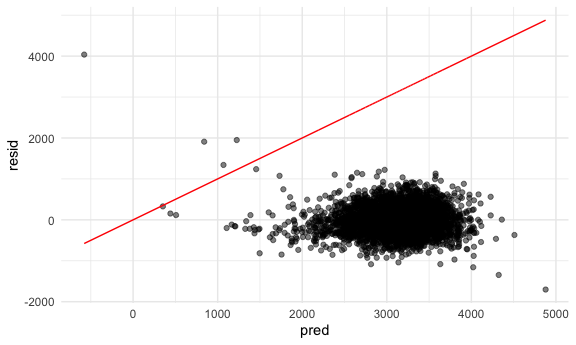

Homework 6
================
Megan Marziali

``` r
library(tidyverse)
library(rvest)
library(ggplot2)
library(patchwork)
library(modelr)
library(mgcv)

knitr::opts_chunk$set(
  fig.width = 6,
  fig.asp = 0.6,
  out.width = "90%"
)

theme_set(theme_minimal() + theme(legend.position = "bottom"))

options(
  ggplot2.continuous.colour = "viridis",
  ggplot2.continuous.fill = "viridis"
)

scale_colour_discrete = scale_color_viridis_d
scale_fill_discrete = scale_fill_viridis_d

set.seed(1)
```

## Problem 1

Read in the data.

``` r
homicide_df = 
  read_csv("./data/homicides.csv", na = c("", "NA", "Unknown")) %>% 
  mutate(
    city_state = str_c(city, state, sep = ", "),
    victim_age = as.numeric(victim_age),
    resolution = case_when(
      disposition == "Closed without arrest" ~ 0,
      disposition == "Open/No arrest"        ~ 0,
      disposition == "Closed by arrest"      ~ 1)
  ) %>% 
  filter(
    victim_race %in% c("White", "Black"),
    city_state != "Tulsa, AL") %>% 
  select(city_state, resolution, victim_age, victim_race, victim_sex)
```

Start with one city.

``` r
baltimore_df = 
  homicide_df %>% 
  filter(city_state == "Baltimore, MD")

glm(resolution ~ victim_age + victim_race + victim_sex, 
    data = baltimore_df,
    family = binomial()) %>% 
  broom::tidy() %>% 
  mutate(
    OR = exp(estimate),
    CI_lower = exp(estimate - 1.96 * std.error),
    CI_upper = exp(estimate + 1.96 * std.error)
  ) %>% 
  select(term, OR, starts_with("CI")) %>% 
  knitr::kable(digits = 3)
```

| term              |    OR | CI\_lower | CI\_upper |
| :---------------- | ----: | --------: | --------: |
| (Intercept)       | 1.363 |     0.975 |     1.907 |
| victim\_age       | 0.993 |     0.987 |     1.000 |
| victim\_raceWhite | 2.320 |     1.648 |     3.268 |
| victim\_sexMale   | 0.426 |     0.325 |     0.558 |

Try this across cities.

``` r
models_results_df = 
  homicide_df %>% 
  nest(data = -city_state) %>% 
  mutate(
    models = 
      map(.x = data, ~glm(resolution ~ victim_age + victim_race + victim_sex, data = .x, family = binomial())),
    results = map(models, broom::tidy)
  ) %>% 
  select(city_state, results) %>% 
  unnest(results) %>% 
  mutate(
    OR = exp(estimate),
    CI_lower = exp(estimate - 1.96 * std.error),
    CI_upper = exp(estimate + 1.96 * std.error)
  ) %>% 
  select(city_state, term, OR, starts_with("CI"))
```

``` r
models_results_df %>% 
  filter(term == "victim_sexMale") %>% 
  mutate(city_state = fct_reorder(city_state, OR)) %>% 
  ggplot(aes(x = city_state, y = OR)) + 
  geom_point() + 
  geom_errorbar(aes(ymin = CI_lower, ymax = CI_upper)) + 
  theme(axis.text.x = element_text(angle = 90, hjust = 1))
```


## Problem 2

Loading and cleaning birthweight data.

``` r
bw_df = 
  read_csv("./data/birthweight.csv", na = c("", "NA", "Unknown")) %>% 
  mutate(
    babysex = as.factor(babysex),
    frace = as.factor(frace),
    malform = as.factor(malform),
    mrace = as.factor(mrace)
  )
```

    ## Parsed with column specification:
    ## cols(
    ##   .default = col_double()
    ## )

    ## See spec(...) for full column specifications.

There is a total of 20 variables included in this dataset, including
sociodemographic information on the mother and father (such as race and
income); the baby’s sex, head circumference (cm), length at birth (cm)
and birthweight (g); gestational age (weeks); and extensive biological
information on the mother, including mother’s weight at delivery (lbs),
parity, pre-pregnancy BMI and average number of cigarettes smoked during
pregnancy. There are 0 missing values.

I opted to investigate the impact of the mother’s weight gain during
pregnancy on the child’s birth weight. Potential confounders included *a
priori* hypothesized predictors, such as average number of cigarettes
smoked during pregnancy, the mother’s age, baby’s length at birth,
family income, gestational age, and mother’s height. I subsequently used
the 10% rule for including confounders. Using this information, I
adjusted for all aforementioned confounders except for mother’s age.

``` r
# Main exposure
lm(bwt ~ wtgain, data = bw_df) %>% 
  broom::tidy()
```

    ## # A tibble: 2 x 5
    ##   term        estimate std.error statistic  p.value
    ##   <chr>          <dbl>     <dbl>     <dbl>    <dbl>
    ## 1 (Intercept)   2859.     17.0       169.  0.      
    ## 2 wtgain          11.6     0.688      16.8 1.73e-61

``` r
# Included as confounder
lm(bwt ~ smoken, data = bw_df) %>% 
  broom::tidy()
```

    ## # A tibble: 2 x 5
    ##   term        estimate std.error statistic     p.value
    ##   <chr>          <dbl>     <dbl>     <dbl>       <dbl>
    ## 1 (Intercept)  3136.        8.88    353.   0          
    ## 2 smoken         -5.23      1.05     -5.00 0.000000607

``` r
# Not included as confounder
lm(bwt ~ momage, data = bw_df) %>% 
  broom::tidy()
```

    ## # A tibble: 2 x 5
    ##   term        estimate std.error statistic  p.value
    ##   <chr>          <dbl>     <dbl>     <dbl>    <dbl>
    ## 1 (Intercept)   2750.      41.0      67.0  0.      
    ## 2 momage          17.9      1.99      9.03 2.57e-19

``` r
# Included as confounder
lm(bwt ~ blength, data = bw_df) %>% 
  broom::tidy()
```

    ## # A tibble: 2 x 5
    ##   term        estimate std.error statistic   p.value
    ##   <chr>          <dbl>     <dbl>     <dbl>     <dbl>
    ## 1 (Intercept)   -3841.     95.1      -40.4 5.44e-303
    ## 2 blength         140.      1.91      73.2 0.

``` r
# Included as confounder
lm(bwt ~ fincome, data = bw_df) %>% 
  broom::tidy()
```

    ## # A tibble: 2 x 5
    ##   term        estimate std.error statistic  p.value
    ##   <chr>          <dbl>     <dbl>     <dbl>    <dbl>
    ## 1 (Intercept)  2980.      15.1       197.  0.      
    ## 2 fincome         3.05     0.296      10.3 1.26e-24

``` r
# Included as confounder
lm(bwt ~ gaweeks, data = bw_df) %>% 
  broom::tidy()
```

    ## # A tibble: 2 x 5
    ##   term        estimate std.error statistic   p.value
    ##   <chr>          <dbl>     <dbl>     <dbl>     <dbl>
    ## 1 (Intercept)    476.      88.8       5.36 8.76e-  8
    ## 2 gaweeks         66.9      2.25     29.8  9.69e-178

``` r
# Included as confounder
lm(bwt ~ mheight, data = bw_df) %>% 
  broom::tidy()
```

    ## # A tibble: 2 x 5
    ##   term        estimate std.error statistic  p.value
    ##   <chr>          <dbl>     <dbl>     <dbl>    <dbl>
    ## 1 (Intercept)    762.     183.        4.18 3.03e- 5
    ## 2 mheight         37.0      2.87     12.9  2.18e-37

``` r
# Included as confounder
lm(bwt ~ ppwt, data = bw_df) %>% 
  broom::tidy()
```

    ## # A tibble: 2 x 5
    ##   term        estimate std.error statistic  p.value
    ##   <chr>          <dbl>     <dbl>     <dbl>    <dbl>
    ## 1 (Intercept)  2541.      47.4        53.6 0.      
    ## 2 ppwt            4.65     0.379      12.3 5.69e-34

``` r
m1_fit = lm(bwt ~ wtgain + smoken + blength + fincome + gaweeks + mheight + ppwt, data = bw_df)

broom::tidy(m1_fit)
```

    ## # A tibble: 8 x 5
    ##   term        estimate std.error statistic   p.value
    ##   <chr>          <dbl>     <dbl>     <dbl>     <dbl>
    ## 1 (Intercept) -4705.     145.       -32.4  2.49e-206
    ## 2 wtgain          5.06     0.462     11.0  1.42e- 27
    ## 3 smoken         -3.71     0.668     -5.55 3.10e-  8
    ## 4 blength       121.       1.99      60.6  0.       
    ## 5 fincome         1.69     0.192      8.79 2.09e- 18
    ## 6 gaweeks        24.7      1.68      14.7  6.71e- 48
    ## 7 mheight         7.16     2.07       3.46 5.55e-  4
    ## 8 ppwt            1.76     0.272      6.47 1.11e- 10

Investigating model fit:

``` r
bw_df %>% 
  add_predictions(m1_fit) %>% 
  add_residuals(m1_fit) %>% 
  ggplot(aes(x = pred, y = resid)) + 
  geom_point() +
  geom_line(aes(y = pred), color = "red")
```



Running the other two models.

``` r
m2_fit = lm(bwt ~ blength + gaweeks, data = bw_df) %>% 
  broom::tidy()

m3_fit = lm(bwt ~ bhead * blength * babysex, data = bw_df) %>% 
  broom::tidy()
```

The next step is comparing model 1 to models 2 and 3 using
cross-validation.

Splitting the data into testing and training datasets:

``` r
cv_df = 
  crossv_mc(bw_df, 100) %>% 
  mutate(
    train = map(train, as_tibble),
    test = map(test, as_tibble)
  )
```

Calculating RMSEs:

``` r
cv_df = 
  cv_df %>% 
  mutate(
    m1_fit = map(train, ~lm(bwt ~ wtgain + smoken + blength + fincome + gaweeks + mheight + ppwt, data = .x)),
    m2_fit = map(train, ~lm(bwt ~ blength + gaweeks, data = .x)),
    m3_fit = map(train, ~lm(bwt ~ bhead * blength * babysex, data = as_tibble(.x)))) %>% 
  mutate(
    rmse_m1 = map2_dbl(m1_fit, test, ~rmse(model = .x, data = .y)),
    rmse_m2 = map2_dbl(m2_fit, test, ~rmse(model = .x, data = .y)),
    rmse_m3 = map2_dbl(m3_fit, test, ~rmse(model = .x, data = .y)))
```

Investigating RMSEs across models:

``` r
cv_df %>% 
  select(starts_with("rmse")) %>% 
  pivot_longer(
    everything(),
    names_to = "model", 
    values_to = "rmse",
    names_prefix = "rmse_") %>% 
  mutate(model = fct_inorder(model)) %>% 
  ggplot(aes(x = model, y = rmse)) + geom_violin()
```


